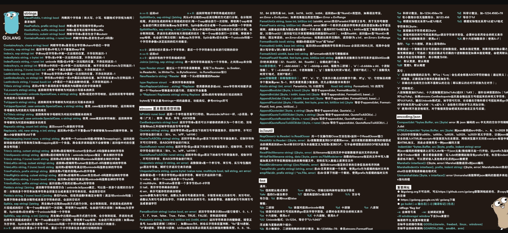
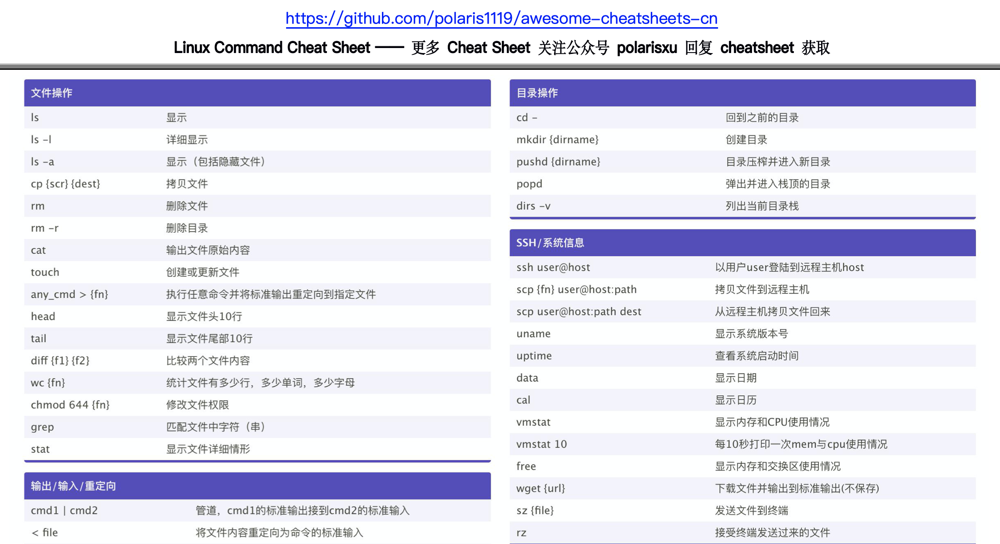

# polarisxu：一起学习成长

专为国人开发者打造的 Cheat Sheet — 操作系统、数据库、编程语言、框架和开发工具等速查表。通过一个文件快速掌握或查找你所需的关键知识。

> Cheat Sheet 是什么？速查表。形式没有统一的标准。

## 缘起

2019 年 10 月，我在朋友圈发了一个张图：（来源网络，并非我原创）

很多人问有无高清版，想要收藏，甚至说当鼠标垫。

这几天，我又做了几个 Cheat Sheet，从获取人数看，大家还是很喜欢这种速查表形式。

我看了下 GitHub 上，虽然有 Cheat Sheet 相关的项目，但并非这种表格的形式，格式比较随意，不太适合查找，至少不适合做成鼠标垫 🤣，因此我决定开启这个项目，陆续不断整理各种编程语言、框架和开发工具等速查表！创作、整理不易。如果觉得不错，请**点击 Star 支持下**吧！

## 下载

因为都是 PDF 格式，不想仓库过于庞大（当然也希望你关注我的公众号，支持下我），仓库中只放了部分图片内容。需要完整 PDF 内容，请关注我的公众号，回复 666 获取。（记得给本项目来个 Star，持续关注后续更新）

如图片无法显示，请[点击这里](https://static.studygolang.com/static/img/polarisxu-qrcode-m.jpg?imageView2/2/w/280)。

也许你想加我的私人微信，跟我交流或进群交流：[个人名片](https://static.studygolang.com/static/img/gopherstudio2.png)。

## 📚内容索引

### 📃编程语言

#### Go

- [Go Tools](languages/go/go-tooling-cheat-sheet.png)
- [Go 数据科学](languages/go/data-science-in-go-cheat-sheet.png)

### 辅助

- [正则表达式](languages/other/regex-cheat-sheet.png)

### 操作系统

- [Linux 命令](os/linux/Linux-Command-Cheat-Sheet.png)

### 框架

- [pandas](frameworks/pandas.png)

### 🔧工具

- [Git](tools/git-cheat-sheet.png)
- [Vim](tools/vim-cheat-sheet.png)

## 声明

有些 CheatSheet 是本人原创整理，有些来自网络，进行加工处理。如有侵权，请告知！
